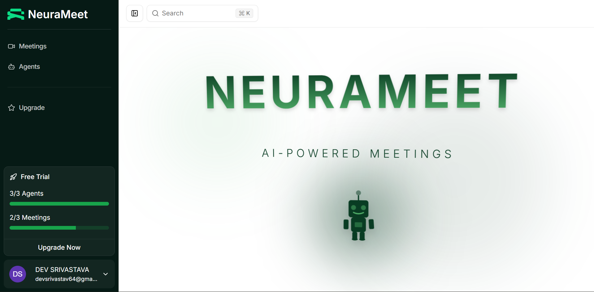
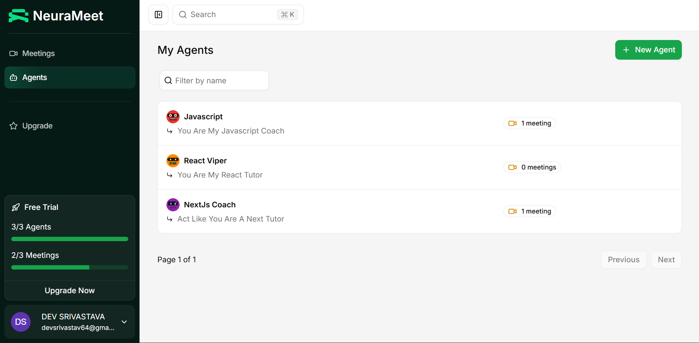
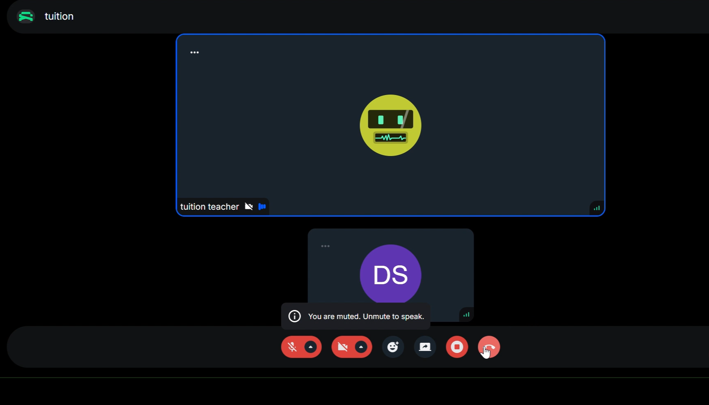
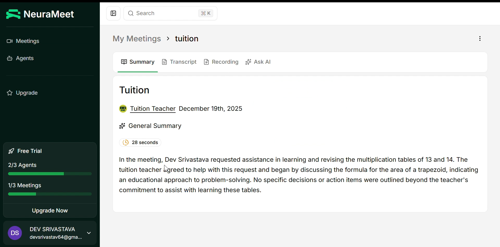
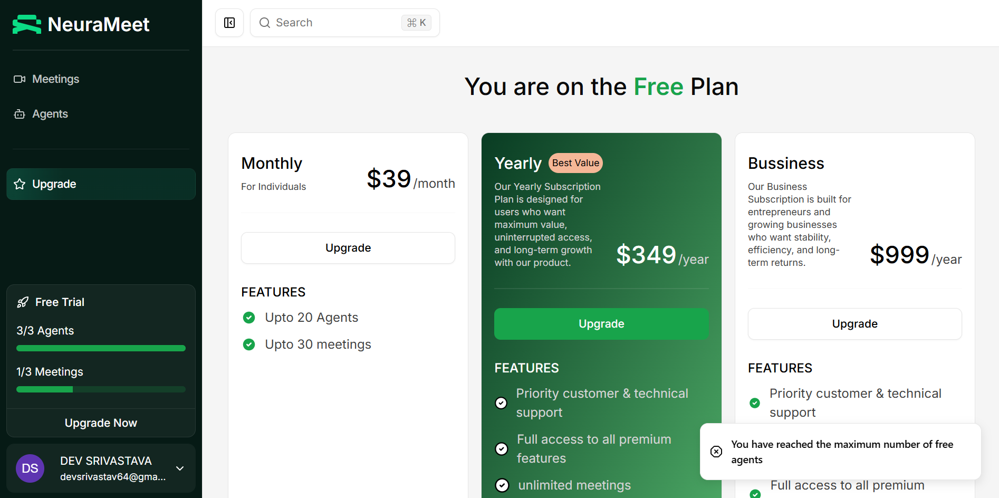
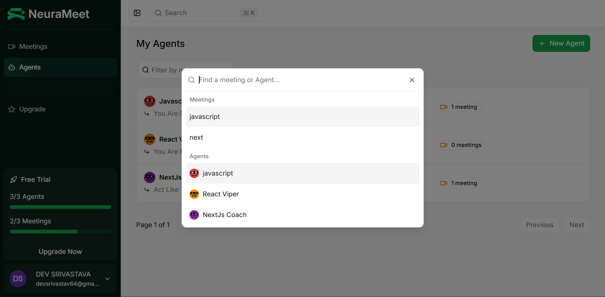
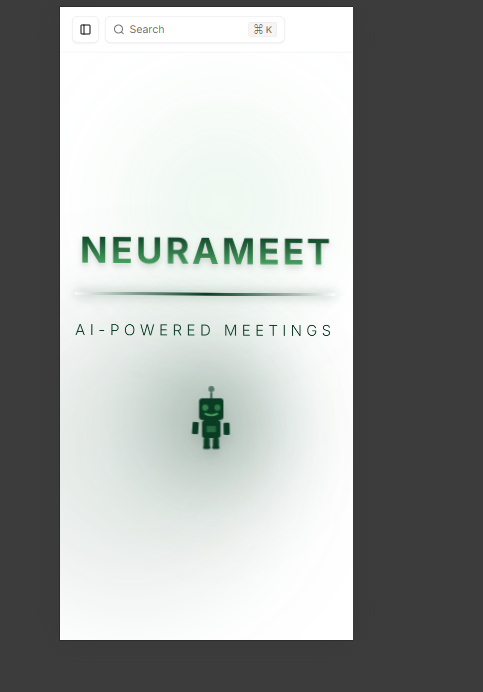
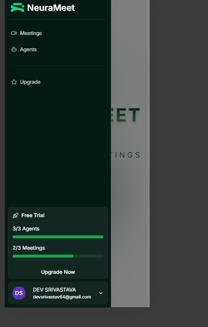
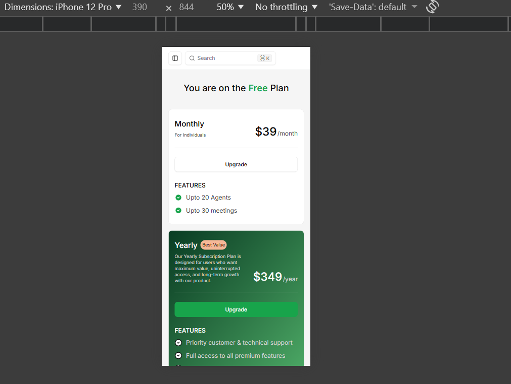
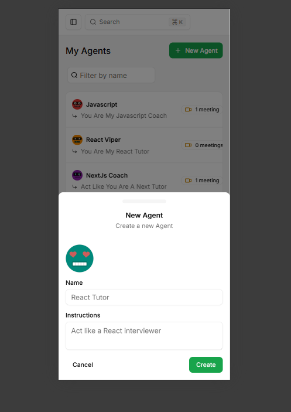

# 🤖 NeuraMeet

> AI-Powered Virtual Meeting Platform with Intelligent Agents

--- 

<p align="center">
  
</p>

<p align="center">
  
  
  
</p>

---

NeuraMeet is a cutting-edge virtual meeting platform that revolutionizes online collaboration by integrating AI agents directly into your video calls. Create custom AI agents with specific instructions, conduct interactive meetings, and get instant summaries, transcripts, and recordings—all in one seamless experience.

---

## ✨ Key Features

### 🤖 AI-Powered Meetings



- **Custom Real-Time Agents** - Create AI agents with custom instructions that act according to your needs
- **Interactive AI Conversations** - Invite AI agents directly into your video calls for real-time interaction
- **OpenAI Integration** - Powered by advanced OpenAI models for intelligent responses

### 📹 Video & Communication



- **HD Video Calls** - Crystal clear video meetings powered by Stream Video SDK
- **Real-Time Chat** - Integrated chat functionality using Stream Chat SDK
- **Mobile Responsive** - Fully responsive design works seamlessly on all devices

### 📝 Post-Meeting Intelligence



- **AI-Generated Summaries** - Automatic meeting summaries generated after each call
- **Full Transcripts** - Complete transcription of all meeting conversations
- **Video Recordings** - Access recorded meetings anytime
- **AI Meeting Q&A** - Ask questions about your meeting content using AI
- **Transcript Search** - Quickly find specific moments in your meetings
- **Video Playback** - Review meetings with easy-to-use playback controls

### 📊 Meeting Management


- **Meeting History** - Keep track of all your past meetings
- **Meeting Statuses** - Monitor ongoing, scheduled, and completed meetings
- **Agent Management** - Create and manage multiple AI agents with different personalities

### 💳 Subscription & Credits



- **Free Trial** - Get 3 free credits to try agents and meetings
- **Credit System** - Each agent creation and meeting costs 1 credit
- **Paid Plans** - Monthly ($39) and Yearly ($349) subscription options
- **Seamless Payments** - Integrated Polar payment system
- **Auto Upgrade Flow** - Redirects to upgrade page when credits are exhausted

### ⚡ User Experience



- **Quick Search** - Press `Ctrl+K` (or `Cmd+K` on Mac) to instantly open the search bar
- **Secure Authentication** - Better Auth integration for secure login
- **Intuitive UI** - Beautiful interface built with Tailwind v4 and Shadcn/ui
- **Background Jobs** - Inngest handles transcription and summary generation asynchronously

---

## 📸 Responsiveness

<details>
<summary>🖼️ Click to view all screenshots</summary>

### Home Overview


### Dashboard Overview


### Pricing Page


### User Interface Details


</details>

---

## 🛠️ Tech Stack

### Frontend
- **Next.js 15** - React framework with App Router
- **React 19** - Latest React features
- **TypeScript** - Type-safe development
- **Tailwind CSS v4** - Utility-first styling
- **Shadcn/ui** - Beautiful component library

### Backend & Database
- **tRPC** - End-to-end typesafe APIs
- **Drizzle ORM** - Type-safe database queries
- **Neon Database** - Serverless Postgres
- **TanStack Query** - Data fetching and caching

### Integrations
- **Stream Video SDK** - Video calling infrastructure
- **Stream Chat SDK** - Real-time messaging
- **OpenAI API** - AI agent intelligence
- **Better Auth** - Authentication solution
- **Polar** - Subscription payments
- **Inngest** - Background job processing

---

## 🚀 Getting Started

### Prerequisites
- Node.js 18+ 
- pnpm (recommended) or npm
- Neon Database account
- Stream account (Video & Chat)
- OpenAI API key
- Polar account (for payments)
- Better Auth setup

### Installation

1. **Clone the repository**
```bash
git clone https://github.com/MD-5-5/NeuraMeet.git
cd neurameet
```

2. **Install dependencies**
```bash
npm install --legacy-peer-deps
```

3. **Set up environment variables**

Create a `.env.local` file in the root directory:

```env
# Database
DATABASE_URL=your_neon_database_url

# Stream
NEXT_PUBLIC_STREAM_API_KEY=your_stream_api_key
STREAM_SECRET_KEY=your_stream_secret_key

# OpenAI
OPENAI_API_KEY=your_openai_api_key

# Better Auth
BETTER_AUTH_SECRET=your_auth_secret
BETTER_AUTH_URL=http://localhost:3000

# Polar
POLAR_ACCESS_TOKEN=your_polar_access_token
NEXT_PUBLIC_POLAR_SUBSCRIPTION_ID=your_subscription_id

# Inngest
INNGEST_EVENT_KEY=your_inngest_key
INNGEST_SIGNING_KEY=your_signing_key
```

4. **Run database migrations**
```bash
npm run db:push
```

5. **Start the development server**
```bash
npm run dev
```

6. **Open your browser**

Navigate to [http://localhost:3000](http://localhost:3000)

---

## 📱 Features Walkthrough

### Creating an AI Agent
1. Navigate to the "Agents" section
2. Click "Create Agent"
3. Provide custom instructions (e.g., "Act as a technical advisor")
4. Your agent is ready to join meetings!

### Starting a Meeting
1. Go to "Meetings"
2. Click "New Meeting"
3. Invite your AI agent
4. Start the video call and interact naturally

### After the Meeting
- View auto-generated summary
- Read full transcript
- Watch video recording
- Ask AI questions about the meeting content
- Search through transcript for specific topics

---

## 💰 Pricing

**Free Plan**
- 3 free credits
- Try all features

**Monthly Plan - $39/month**
- Up to 20 Agents
- Up to 30 Meetings
- Full feature access

**Yearly Plan - $349/year** (Best Value)
- Priority support
- Full premium features
- Maximum value for heavy users

---

## 🎯 Use Cases

- **Team Standup Meetings** - AI agent takes notes and creates action items
- **Client Presentations** - AI assistant answers technical questions
- **Brainstorming Sessions** - AI agent contributes creative ideas
- **Training Sessions** - AI tutor helps explain complex concepts
- **Interview Practice** - AI agent conducts mock interviews

---

## 🤝 Contributing

Contributions are welcome! Please feel free to submit a Pull Request.

---

## 🙏 Acknowledgments

- Stream for video and chat infrastructure
- OpenAI for AI capabilities

---

<p align="center">
  <b>Built with ❤️ by Baba MD5</b>
</p>

<p align="center">
  <i>For support or questions, please open an issue or reach out on LinkedIn.</i>
</p>
